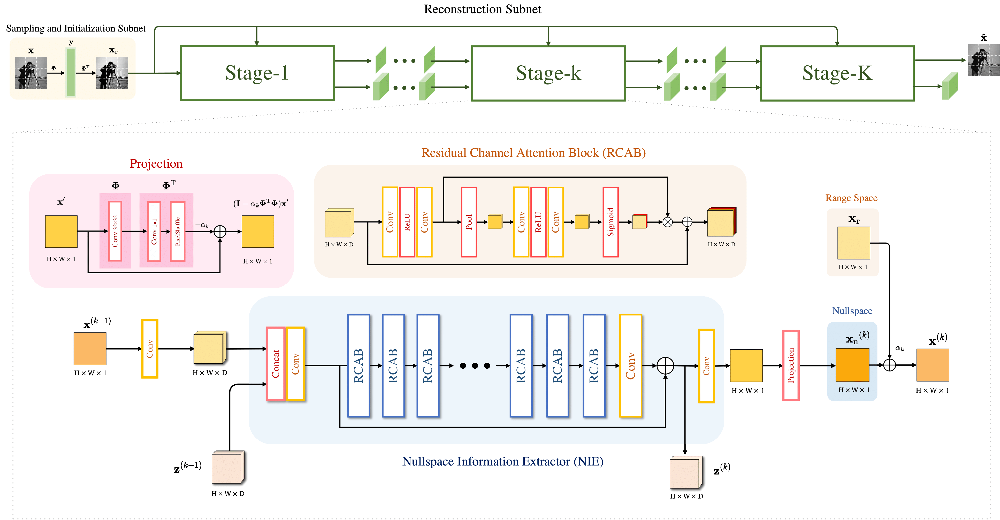

# High-Throughput Decomposition-Inspired Deep Unfolding Network for Image Compressed Sensing


## Abstract
Deep Unfolding Network (DUN) has achieved great success in the image Compressed Sensing (CS) field benefiting from its great interpretability and performance. However, existing DUNs suffer from limited information transmission capacity with increasingly complex structures, leading to undesirable results. Besides, current DUNs are mostly established based on one specific optimization algorithm, which hampers the development and understanding of DUN. In this paper, we propose a new unfolding formula combining the Approximate Message Passing algorithm (AMP) and Range-Nullspace Decomposition (RND), which offers new insights for DUN design. To maximize information transmission and utilization, we propose a novel High-Throughput Decomposition-Inspired Deep Unfolding Network (HTDIDUN) based on the new formula. Specifically, we design a powerful Nullspace Information Extractor (NIE) with high-throughput transmission and stacked residual channel attention blocks. By modulating the dimension of the feature space, we provide three implementations from small to large. Extensive experiments on natural and medical images manifest that our HTDIDUN family members outperform other state-of-the-art methods by a large margin. Our codes and pre-trained models are available on GitHub to facilitate further exploration.

## Network Architecture



## Test

Download and unzip the pretrained models [pretrained_models.zip](https://drive.google.com/file/d/1jRryzrtNbXzuUMUnkpb68-xsm3LpdVgr/view?usp=drive_link). Put them into  `./model/` then run:

```shell
python test.py --testset_name Set11 --cs_ratio=0.1/0.2/0.3/0.4/0.5
```

- We also provide a 128 channel HTDIDUN for 0.3 CS ratio in the pretrained models which owns superior performance but requires long time for training and inference.
 
## Train 
Download the dataset of [Waterloo Exploration Database](https://kedema.org/project/exploration/index.html) and put the `pristine_images` directory (containing 4744 `.bmp` image files) into `./data`, then run:
```shell
python train.py --cs_ratio=0.1/0.2/0.3/0.4/0.5
```

## Citation

```
@ARTICLE{10835111,
  author={Li, Tiancheng and Yan, Qiurong and Li, Yi and Yan, Jinwei},
  journal={IEEE Transactions on Computational Imaging}, 
  title={High-Throughput Decomposition-Inspired Deep Unfolding Network for Image Compressed Sensing}, 
  year={2025},
  volume={},
  number={},
  pages={1-12},
  keywords={Imaging;Approximation algorithms;Optimization;Message passing;Image reconstruction;Compressed sensing;Noise reduction;Iterative algorithms;Inverse problems;IP networks;Compressed sensing;deep unfolding network;convolutional neural network;image restoration},
  doi={10.1109/TCI.2025.3527880}}
```

## Acknowledgement

Our works is built on the codes of [PRL](https://github.com/Guaishou74851/PRL). Thanks for their sharing.
